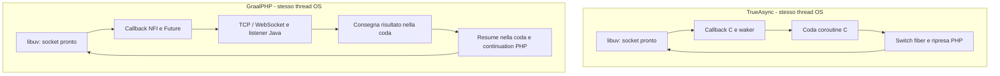

# TrueAsync e GraalPHP: reactor, ripresa delle coroutine e costo reale

Analisi del 25 settembre 2026. Il confronto riguarda il server Windows con
un worker, WebSocket echo e relay HTTP tramite cURL. Non riguarda il pool
HTTP/3 opzionale, Compose o lo spawn di worker PHP.

Questa analisi conserva la baseline e gli esperimenti originali. Il successivo
[allineamento dello scheduler](trueasync-alignment.md) porta il collector
`compact` nel prodotto, separa la FIFO locale dall'inbox esterna e introduce
i conteggi degli scope. Le descrizioni di `LinkedBlockingQueue`, scansioni e
collector non corretto qui sotto si riferiscono quindi alla baseline misurata.

## Il modello dei due loop

In TrueAsync non ci sono un reactor PHP e un reactor libuv indipendenti
che si passano le richieste fra due thread. Lo scheduler decide quale
coroutine eseguire; il reactor è l'implementazione libuv delle operazioni
di attesa. Con un worker, tutto questo avviene sullo stesso thread OS.
La coroutine dedicata allo scheduler possiede un contesto fiber, non un
secondo thread OS. Anche GraalPHP, dopo il consolidamento, usa un solo
thread proprietario per PHP, `uv_run` e callback di rete.

La [descrizione ufficiale](https://true-async.github.io/en/architecture/scheduler-reactor.html)
conferma che TrueAsync può eseguire il tick nel contesto della coroutine
che si sospende, passando direttamente alla successiva quando è pronta.
Il contesto dello scheduler serve soprattutto quando la coda è vuota e
occorre attendere eventi. Non è quindi necessario copiare un modello con
due loop eseguiti da due thread per avvicinarsi a TrueAsync.

| Passaggio | TrueAsync 0.10.0 | GraalPHP corrente |
| --- | --- | --- |
| Coroutine pronta | Puntatore in circular buffer C; waker evita accodamenti duplicati | `Runnable`/`Resume` in `LinkedBlockingQueue`, Future e registrazioni Java |
| Sospensione | Avvia gli eventi del waker; risultato già disponibile evita lo switch | Bytecode DSL `ContinuationResult`, stato dell'Activation e registrazioni sui Future |
| Se c'è altro PHP pronto | Tick nel contesto corrente e possibile passaggio diretto alla prossima fiber | Ritorno al driver Java, consegna del risultato, nuova azione `Resume` |
| Avanzamento I/O | `libuv_reactor_execute(no_wait)` chiama `uv_run`; evita il passaggio se il loop non è alive | Due `UV_RUN_NOWAIT` intorno a un pump di massimo 64 azioni CLI |
| Nessun PHP pronto | `UV_RUN_ONCE`, risvegliato da eventi o timer | `UV_RUN_ONCE`, con deadline dello scheduler rappresentata da un timer one-shot |
| Evento completato | Callback C aggiorna il waker e accoda la coroutine | Callback NFI risolve il Future; adattatori TCP/WS aggiornano lo stato; listener accodato e poi `Resume` |
| Callback I/O e guest | La ripresa PHP è separata dalla notifica dell'evento | Anche qui il callback nativo non esegue PHP guest |
| cURL | Multi/socket, callback socket/timer e drenaggio `CURLMSG_DONE` | Stesso modello multi/socket; aggiunge NFI e wrapper PHP interno per cleanup/cancellazione |
| Scope | Conteggi di coroutine attive aggiornati agli eventi del ciclo di vita | Verifiche `finished`, `pending` e aggiornamenti di scope tramite liste |
| Codice del protocollo | Server nativo C, wslay e buffer di trasporto | Parser/framing Java, copie di byte array e catene di `CompletableFuture` |

In GraalPHP `Scheduler.listen` accoda la consegna del risultato;
`WaitRegistration.settle` chiama poi `resumeLater`, che accoda la ripresa.
Il percorso ha quindi normalmente due azioni di scheduler dopo il Future,
oltre alle catene dei Future del protocollo. `await` su risultato già pronto
ha invece un percorso immediato. NFI ricava il binding da una cache, ma ogni
chiamata passa ancora da chiave `Symbol`, lookup e interop uncached: non è
un semplice call diretto C→C come nell'estensione Zend.



Il tick TrueAsync durante le catene di suspend contiene una soglia di
100 ms (`REACTOR_CHECK_INTERVAL`). **Non è un polling timer da 100 ms che
ritarda ogni risposta:** se non ci sono coroutine pronte il driver entra
subito nel reactor. Nel loop principale il sorgente 0.10.0 limita ulteriormente
i tick su Linux usando il clock coarse; su Windows quel limite aggiuntivo
non si applica. La variante sperimentale GraalPHP descritta sotto cambia
solo il batch del pump, senza introdurre quel timer o dichiarare equivalenza
completa con lo scheduling di TrueAsync.

## Deadline, wakeup e server

Per notifiche interne allo stesso thread, il server TrueAsync dispone di
`async_plain_event`: evento ABI e lista di callback, senza handle libuv.
GraalPHP ha eliminato `uv_async_send` dalle submission del proprietario;
il risveglio nativo rimane per completamenti che arrivano da altri thread.
La patch Electron interviene nell'embedding, non nel server CLI misurato.

Il server TrueAsync 0.15.0 usa anche un watchdog periodico per le deadline
delle connessioni: un timer per worker, scansione delle connessioni attive,
intervallo calcolato dai timeout con minimo 250 ms. Non sarebbe corretto
descrivere tutto il server upstream come privo di timer periodici.
GraalPHP usa invece un timer cancellabile per ogni lettura/scrittura con
deadline, con relativi Future e chiamate NFI. Per mantenere il nostro requisito
senza tick periodico, l'alternativa da valutare è un insieme ordinato di
deadline e un solo timer armato alla più vicina, non la copia del watchdog.

Le scritture native del server hanno anche percorsi di raggruppamento e
riuso dei buffer. GraalPHP costruisce un frame Java, lo copia nel buffer
nativo e aspetta il completamento della scrittura. Nell'echo a carico chiuso
con una richiesta in volo per socket, il vantaggio del raggruppamento ha
comunque un limite: non si può dedurne da solo l'intero divario misurato.

## cURL: integrazione simile, cache diversa

Il binario TrueAsync misurato riporta libcurl 8.22.0; GraalPHP incorpora la
8.21.0 di curl-impersonate. Non è solo una differenza TLS: nel sorgente
[8.21.0, conncache.c](https://github.com/curl/curl/blob/curl-8_21_0/lib/conncache.c)
la cache predefinita può espellere connessioni quando supera quattro volte
il numero di trasferimenti in esecuzione. Nella
[8.22.0](https://github.com/curl/curl/blob/curl-8_22_0/lib/conncache.c)
il limite stimato è basato sui trasferimenti associati e l'espulsione
predefinita richiede almeno un secondo di inattività della connessione.

Questa differenza riduce la tendenza a chiudere connessioni appena usate
quando il numero di trasferimenti attivi scende momentaneamente. È un
meccanismo coerente con i migliaia di endpoint osservati e l'esaurimento
delle porte nella precedente serie; la sua quota esatta di errori e costo
CPU richiede un A/B della libreria/cache. Non è attribuibile al fatto che
libuv esegua sullo stesso thread PHP, né è dimostrato che spieghi ogni errore.
Le varianti di questa analisi mantengono tutte la stessa libcurl 8.21.0.
Il pin appartiene alla release curl-impersonate: non va aggiornato indipendentemente
per inseguire curl standard. L'ipotesi sulla cache non autorizza un cambio della
libreria sottostante; un eventuale secondo provider deve avere simboli isolati.

## Il costo emerso fuori dal reactor

`PhpValues.Scope.close()` chiama il nostro `Heap.collectCycles()` a ogni
chiusura di scope dei valori. È la raccolta dei cicli del modello PHP,
**non il garbage collector di GraalVM**. `curl_exec` passa dal wrapper
interno `curl_execute` e da una closure di cleanup protetta; la chiusura
di queste attivazioni esercita quel percorso a ogni trasferimento.

Il set `Heap.candidates` usa una `IdentityHashMap`. Dopo essere cresciuta,
la tabella conserva la capacità anche quando si svuota; iterarla e azzerarla
ha un costo legato alla capacità, non soltanto agli elementi rimasti.
La [documentazione JDK](https://docs.oracle.com/en/java/javase/25/docs/api/java.base/java/util/IdentityHashMap.html)
esplicita il costo dell'iterazione proporzionale al numero di bucket.
Il codice di `clear` nel JDK locale azzera la tabella senza ridimensionarla.
Questo rende plausibile un costo ripetuto dipendente dal picco precedente
di coroutine, anche quando quelle coroutine sono ferme e non richiedono I/O.

Il JFR della Native Image con 10.000 coroutine e relay a 64 client trova
253 campioni su 263 dentro `collectCycles`; 163 intercettano
`IdentityHashMap.clear` e 89 l'iteratore della mappa. Nell'echo ci sono solo
46 campioni sul proprietario. **Questi conteggi non sono percentuali CPU
affidabili:** su Windows il campionamento Native Image usa recurring callback
e ha forte bias verso i safepoint. Sono serviti a formulare l'esperimento,
non a sostituirlo. Anche i pesi di allocazione del profilo restano indicativi.

## Esperimenti controllati

Tre immagini diagnostiche sono generate da copie dei `.class` e di un
singolo sorgente sotto `build/`, tramite `BuildSupport.java`. Il prodotto
`build/graalphp.exe` e i sorgenti sotto `src/` restano quelli della baseline.

| Variante | Unica area modificata | Scopo |
| --- | --- | --- |
| `cycles` | Omessa la chiamata automatica a `collectCycles` alla chiusura dei valori | Isolare il costo; **non utilizzabile in produzione**, cambia il lifetime dei cicli |
| `polls` | Un solo NOWAIT dopo il pump, budget CLI 512 anziché 64 | Misurare il peso della frequenza di attraversamento scheduler/libuv |
| `compact` | Nuovo set dei candidati dopo aver acquisito i candidati del giro corrente | Conservare la raccolta, eliminando la capacità residua della tabella |

Le misure A/B non attivano JFR. Usano lo stesso binario corrente come
controllo, stessa toolchain `-O1`, stessi archivi nativi, server/peer locali,
64 client e due ripetizioni con ordine invertito. Ogni processo è nuovo;
ogni fase dura quattro secondi dopo il warmup. Nessuna build gira durante
le misure. Sono esperimenti brevi, non misure di capacità WAN/TLS o prove
di stabilità di lunga durata.

Mediane di due ripetizioni per immagine, 10.000 coroutine sospese e 64 client.
Ogni esperimento ha il proprio controllo contemporaneo; le sue mediane non
vanno sostituite con quelle del controllo di un altro esperimento.

| Variante | Echo msg/s controllo → variante | Relay msg/s controllo → variante | CPU µs/relay controllo → variante |
| --- | ---: | ---: | ---: |
| `cycles`, raccolta omessa | 11.912 → 13.301 | 3.048 → 5.787 | 329,58 → 172,20 |
| `polls`, pump 512 e un NOWAIT | 12.601 → 12.790 | 2.895 → 2.545 | 346,47 → 391,45 |
| `compact`, raccolta conservata | 12.494 → 13.270 | **3.055 → 5.551** | **330,75 → 179,53** |

La variante `compact` aumenta il relay dell'**81,7%** e riduce il costo
CPU per messaggio del **45,7%**, senza cambiare libuv, NFI, code, cURL o
frequenza della raccolta. Il p95 passa da 29,10 a 15,55 ms. L'intervallo
dei due campioni è 2.873–3.237 msg/s nel controllo e 5.417–5.684 nella variante:
il guadagno supera nettamente la dispersione osservata in questo esperimento.

Il confronto della popolazione conferma il meccanismo:

| Relay a 64 client | 1.000 coroutine sospese | 10.000 coroutine sospese |
| --- | ---: | ---: |
| Controllo corrente | 4.749 msg/s | 3.055 msg/s |
| `compact` | 5.582 msg/s | 5.551 msg/s |

Il degrado legato alle coroutine ferme praticamente scompare ricreando il
set dei candidati dopo ogni raccolta. Questo identifica una causa concreta
nel ciclo di vita dei valori PHP, non nell'esecuzione I/O delle coroutine
ferme. Non significa che tutte le altre scansioni dello scheduler siano
gratuite o che il collector sia già adatto a ogni carico.

Cambiare solo la cadenza del pump dà circa +1,5% nell'echo, entro la
dispersione osservata, e peggiora il relay di circa il 12%. Questo esperimento
non dimostra che ogni possibile algoritmo di scheduling sia equivalente;
dimostra che ridurre semplicemente i passaggi a libuv non risolve il
problema che avevamo osservato.

Tutti i **16/16 casi** degli esperimenti terminano: 4 `cycles`, 4 `polls`,
8 `compact`, **1.099.340 messaggi verificati**. Sono stati poi eseguiti sulla
variante `compact` 53 scenari semantici/lifetime e 72 scenari di integrazione
sulla JVM, più 50 controlli nativi WebSocket → HTTPS → SQLite: tutti passati.
Questa verifica riguarda Windows; non costituisce una nuova validazione Linux.

## Il divario residuo con TrueAsync

Una prova diretta aggiuntiva usa `compact` contro TrueAsync 0.10.0 con lo
stesso peer aggiornato, 10.000 coroutine e 64 client. È **una sola ripetizione**,
separata dalle mediane precedenti; entrambi i casi terminano correttamente.

| Percorso | GraalPHP `compact` msg/s | TrueAsync msg/s | CPU µs/msg G / T | p95 ms G / T |
| --- | ---: | ---: | ---: | ---: |
| Echo | 13.390 | 28.648 | 74,00 / 41,32 | 6,50 / 2,67 |
| Relay cURL | 5.508 | 9.418 | 182,36 / 112,48 | 15,73 / 8,05 |

TrueAsync resta circa 2,14 volte più veloce nell'echo e 1,71 nel relay.
La mappa GC spiega quindi una parte importante del problema, soprattutto
la sensibilità alle coroutine sospese, **non tutto il divario**.

Nello stesso test, il peer rileva 562 endpoint distinti per 34.347 richieste
GraalPHP, contro 64 per 52.968 richieste TrueAsync (warmup incluso).
GraalPHP riconnette più spesso pur eseguendo meno richieste. È un riscontro
concreto a favore dell'indagine sulla cache libcurl 8.21/8.22, che resta
distinta dal collector e dalla cadenza del reactor.

Le differenze ancora da quantificare singolarmente sono il costo delle
continuation Truffle, dei confini NFI, delle due consegne in coda, delle
catene Future e copie del protocollo, e dei timer per operazione. Il profilo
Windows dell'echo è troppo scarso e distorto per attribuire percentuali a
queste componenti. Non è corretto trasformare questa evidenza in una
conclusione generale sulle prestazioni massime di Truffle.

La priorità concreta è correggere la capacità residua della mappa mantenendo
la raccolta, poi allineare e misurare il riuso delle connessioni cURL e rendere
più diretto il percorso interno di completamento e ripresa. Il modello a
un solo proprietario può restare: non serve tornare al thread libuv separato
per rimuovere il collo di bottiglia dimostrato. La variante `polls` non è
un candidato da promuovere sulla base di questi risultati.

## Dati conservati

- [Profilo JFR riassunto](benchmarks/reactor-analysis-windows-2026-09-25/profile/summary.md), [finestre](benchmarks/reactor-analysis-windows-2026-09-25/profile/phases.csv), [ambiente](benchmarks/reactor-analysis-windows-2026-09-25/profile/environment.txt).
- [Esperimento cycles](benchmarks/reactor-analysis-windows-2026-09-25/cycles/results.csv), [polls](benchmarks/reactor-analysis-windows-2026-09-25/polls/results.csv), [compact](benchmarks/reactor-analysis-windows-2026-09-25/compact/results.csv); ciascuna cartella contiene hash/parametri e contatori del peer.
- [Confronto diretto con TrueAsync](benchmarks/reactor-analysis-windows-2026-09-25/trueasync/results.csv) e [contatori del peer](benchmarks/reactor-analysis-windows-2026-09-25/trueasync/fixture.csv).
- [Hash dei sorgenti esaminati](benchmarks/reactor-analysis-windows-2026-09-25/source-hashes.json) e [verifiche della variante compact](benchmarks/reactor-analysis-windows-2026-09-25/compact-validation.txt).

Al momento di questi esperimenti, l'eseguibile prodotto era la baseline SHA-256
`cca86410511f45d32f417935bd4283241fc340815c7641395b7a30b576a20731`.
Le varianti sono strumenti diagnostici: in particolare `cycles` altera il
lifetime e non deve essere distribuita come runtime.

## Riproduzione

```bat
build.bat profile-native
set GRAALPHP_BENCH_PROFILE=1
tools\graalvm-25.4.4.1.1+1.1\bin\javac.exe --release 25 -proc:none -d build\test-classes tests\graalphp\NetworkBenchmark.java tests\graalphp\ProfileReport.java
tools\graalvm-25.4.4.1.1+1.1\bin\java.exe --enable-native-access=ALL-UNNAMED -cp build\test-classes graalphp.NetworkBenchmark 1 10
set GRAALPHP_BENCH_PROFILE=
```

Ogni directory di output contiene JFR per processo e `phases.csv` con le
finestre temporali. `ProfileReport` riceve la directory e stampa le tabelle;
le finestre includono l'apertura dei WebSocket, escludono warmup e shutdown.
La build JFR usa l'opzione ufficiale
[`--enable-monitoring=jfr`](https://www.graalvm.org/latest/reference-manual/native-image/debugging-and-diagnostics/JFR/).
I JFR grezzi restano in `build/`; le tabelle conservate non includono gli
eventi con variabili d'ambiente o percorsi personali.

Con il sorgente corrente il seguente comando confronta il prodotto con la
regressione diagnostica `retained`; non ricostruisce gli hash storici sopra.

```bat
build.bat reactor-probe cycles
build.bat reactor-probe polls
build.bat reactor-probe retained
set GRAALPHP_BENCH_BASELINE=build\graalphp-probe-retained.exe
set GRAALPHP_BENCH_EXECUTABLE=build\graalphp.exe
set GRAALPHP_BENCH_CLIENTS=64
tools\graalvm-25.4.4.1.1+1.1\bin\java.exe --enable-native-access=ALL-UNNAMED -cp build\test-classes graalphp.NetworkBenchmark 2 4 1000,10000
set GRAALPHP_BENCH_BASELINE=
set GRAALPHP_BENCH_EXECUTABLE=
set GRAALPHP_BENCH_CLIENTS=
```

Senza gli override il benchmark mantiene il confronto GraalPHP/TrueAsync
con 64 e 256 client. Gli eseguibili diagnostici hanno nomi distinti e non
sostituiscono il pacchetto corrente.

## Sorgenti consultati

- [php-async 0.10.0, scheduler.c](https://github.com/true-async/php-async/blob/6acdd07ff500f5799ea83bbf333d686b5dacabbf/scheduler.c): enqueue, scheduler_next_tick, switch fiber, loop principale.
- [Stesso commit, libuv_reactor.c](https://github.com/true-async/php-async/blob/6acdd07ff500f5799ea83bbf333d686b5dacabbf/libuv_reactor.c): execute, eventi e operazioni I/O.
- [Stesso commit, scope.c](https://github.com/true-async/php-async/blob/6acdd07ff500f5799ea83bbf333d686b5dacabbf/scope.c): conteggi e notifiche di completamento.
- [Server 0.15.0, http_server_class.c](https://github.com/true-async/server/blob/d86ea96acfda1233fe7da40a03f654725c3510bf/src/http_server_class.c): worker, deadline e gate del pool HTTP/3.
- [Server, http_connection.c](https://github.com/true-async/server/blob/d86ea96acfda1233fe7da40a03f654725c3510bf/src/core/http_connection.c) e [ws_session.c](https://github.com/true-async/server/blob/d86ea96acfda1233fe7da40a03f654725c3510bf/src/websocket/ws_session.c): buffer, invii e sospensione WebSocket.
- Core PHP/TrueAsync: `ext/curl/curl_async.c` e `Zend/zend_gc.c` nel checkout php-xmake locale, scaricato da `true-async-stable` il 16 settembre. Per questi due file non è attestata identità con il core del binario pubblicato il 12 settembre; l'estensione async e il server sopra sono invece fissati ai tag corrispondenti alle versioni del binario.
- GraalPHP: [Scheduler.java](../src/graalphp/runtime/Scheduler.java), [LibuvReactor.java](../src/graalphp/runtime/LibuvReactor.java), [reactor.c](../src/native/reactor.c), [TcpConnection.java](../src/graalphp/runtime/TcpConnection.java), [CurlApi.java](../src/graalphp/runtime/CurlApi.java), [PhpValues.java](../src/graalphp/runtime/PhpValues.java).
